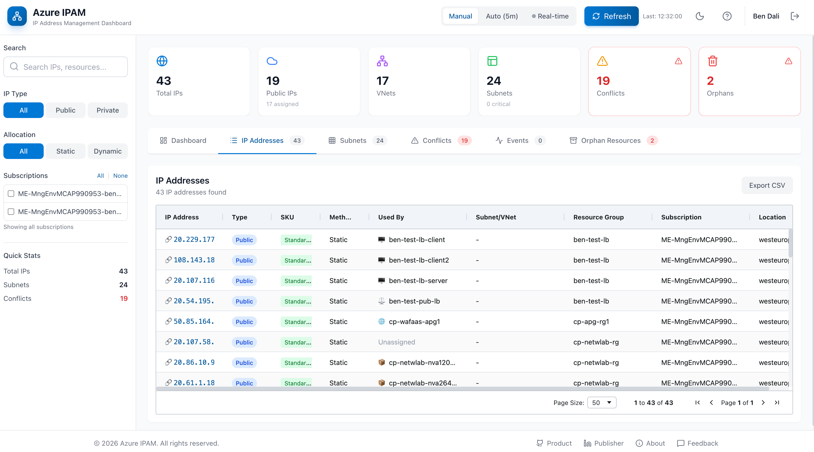

# Azure IPAM Dashboard

A web-based IP Address Management (IPAM) tool for Azure that provides comprehensive visibility into your IP address usage across tenants, subscriptions, and resource groups.



## Features

### 📋 IP Address Inventory
- View all **public and private IP addresses** across your Azure tenant
- Filter by subscription, resource group, IP type, and allocation method
- See which resources are using each IP address
- Click-through to Azure Portal for detailed resource management
- Export to CSV for reporting

### 🔲 Subnet Utilization
- Visual **utilization graphs** for each subnet (color-coded: 🟢 green, 🟡 amber, 🔴 red)
- Group by VNet with expandable/collapsible views
- Track **used vs. available IPs** in real-time
- Identify subnets approaching exhaustion
- View delegations, NSG, and route table associations

### ⚠️ CIDR Conflict Detection
- Automatically detect **overlapping address spaces** across VNets
- Identify subset/superset conflicts
- Impact analysis for each conflict
- Cross-subscription conflict detection

### 📊 Events & Activity Logs
- Track network resource changes (create, update, delete)
- Monitor **IP exhaustion warnings**
- **Quota usage alerts** for public IPs
- Filter by event type, time range, and subscription

## Quick Start

### Prerequisites

- Node.js 18+
- Azure CLI (`az login`)
- Azure subscription with network resources

### Local Development

```bash
# Clone the repository
git clone https://github.com/your-org/azure-ipam.git
cd azure-ipam

# Set up Azure credentials
cd deploy/local
cp .env.example .env
# Edit .env with your Azure credentials

# Install and run
cd ../../frontend
npm install
npm run dev
```

Open `http://localhost:3000` in your browser.

See [Local Deployment Guide](deploy/local/README.md) for detailed instructions.

## Deployment Options

| Deployment | Description | Guide |
|------------|-------------|-------|
| **Local Development** | Native Node.js with hot reload | [deploy/local/](deploy/local/) |
| **Docker** | Production-ready containers with nginx | [deploy/docker/](deploy/docker/) |
| **Kubernetes** | Kustomize manifests with HPA, PDB, ingress | [deploy/kubernetes/](deploy/kubernetes/) |
| **Azure AKS** | Full Azure integration with Key Vault, ACR, Managed Identity | [deploy/azure-aks/](deploy/azure-aks/) |

### Docker Deployment

```bash
cd deploy/docker
cp .env.example .env
# Edit .env with your Azure credentials
docker-compose build
docker-compose up -d
# Access at http://localhost:8080
```

### Kubernetes Deployment

```bash
# Configure secrets
kubectl create namespace azure-ipam
kubectl create secret generic azure-ipam-secrets \
  --namespace azure-ipam \
  --from-literal=AZURE_TENANT_ID=<your-tenant-id> \
  --from-literal=AZURE_CLIENT_ID=<your-client-id> \
  --from-literal=AZURE_CLIENT_SECRET=<your-secret>

# Deploy with Kustomize
kubectl apply -k deploy/kubernetes/base
```

### Azure AKS Deployment

```bash
cd deploy/azure-aks

# Option 1: Automated (creates all Azure resources)
./deploy.sh

# Option 2: Infrastructure as Code
az deployment group create \
  --resource-group rg-azure-ipam \
  --template-file infrastructure/main.bicep
```

## Azure Permissions

This tool requires read-only access to Azure networking resources. A custom "IPAM Reader" role is provided.

See [AZURE-PERMISSIONS.md](docs/AZURE-PERMISSIONS.md) for:
- Custom role definition
- Service principal setup
- Managed identity configuration
- Multi-subscription access

### Quick Role Setup

```bash
# Create the IPAM Reader custom role
az role definition create --role-definition @ipam-reader-role.json

# Create service principal and assign role
az ad sp create-for-rbac --name "ipam-app" --skip-assignment
az role assignment create --assignee "<APP_ID>" --role "IPAM Reader" --scope "/providers/Microsoft.Management/managementGroups/<TENANT_ID>"
```

## Architecture

```
┌─────────────────┐     ┌─────────────────┐     ┌──────────────────┐
│                 │     │                 │     │                  │
│  React Frontend │────▶│  Azure Functions│────▶│  Azure Resource  │
│  (TypeScript)   │     │  API            │     │  Graph           │
│                 │     │                 │     │                  │
└─────────────────┘     └─────────────────┘     └──────────────────┘
        │                       │                       │
        │                       │                       │
        ▼                       ▼                       ▼
┌─────────────────┐     ┌─────────────────┐     ┌──────────────────┐
│  MSAL.js        │     │  Azure Identity │     │  Activity Logs   │
│  (User Auth)    │     │  (API Auth)     │     │  API             │
└─────────────────┘     └─────────────────┘     └──────────────────┘
```

## Technology Stack

- **Frontend**: React 18, TypeScript, Tailwind CSS, AG Grid, Recharts
- **Backend**: Azure Functions (Node.js), Azure SDK
- **Authentication**: MSAL.js, Azure AD / Entra ID
- **Data**: Azure Resource Graph, Azure Activity Logs

## Project Structure

```
Azure-IPAM/
├── frontend/                 # React + TypeScript frontend
│   ├── src/
│   │   ├── components/       # UI components
│   │   ├── pages/            # Page components
│   │   ├── services/         # API client
│   │   └── types/            # TypeScript types
│   └── package.json
├── api/                      # Azure Functions backend
│   ├── src/
│   │   ├── functions/        # HTTP function handlers
│   │   └── shared/           # Shared utilities
│   └── package.json
├── deploy/                   # Deployment configurations
│   ├── local/                # Local development (docker-compose)
│   ├── docker/               # Production Docker containers
│   ├── kubernetes/           # Generic K8s manifests (Kustomize)
│   │   └── base/             # Base manifests
│   └── azure-aks/            # Azure AKS with Key Vault, ACR, Bicep
│       ├── infrastructure/   # Bicep templates
│       └── patches/          # AKS-specific Kustomize patches
├── docs/                     # Documentation
│   └── AZURE-PERMISSIONS.md  # Permissions guide
├── ipam-reader-role.json     # Custom Azure role definition
└── README.md
```

## Configuration

### Environment Variables

| Variable | Description | Required |
|----------|-------------|----------|
| `AZURE_TENANT_ID` | Azure AD tenant ID | Yes |
| `AZURE_CLIENT_ID` | Service principal or app registration ID | Yes |
| `AZURE_CLIENT_SECRET` | Service principal secret (not needed for managed identity) | Depends |
| `VITE_AZURE_CLIENT_ID` | Frontend auth client ID | Yes |
| `VITE_AZURE_TENANT_ID` | Frontend tenant ID | Yes |

## Contributing

Contributions are welcome! Please read our contributing guidelines before submitting a PR.

## License

This project is licensed under the MIT License - see the [LICENSE](LICENSE) file for details.
